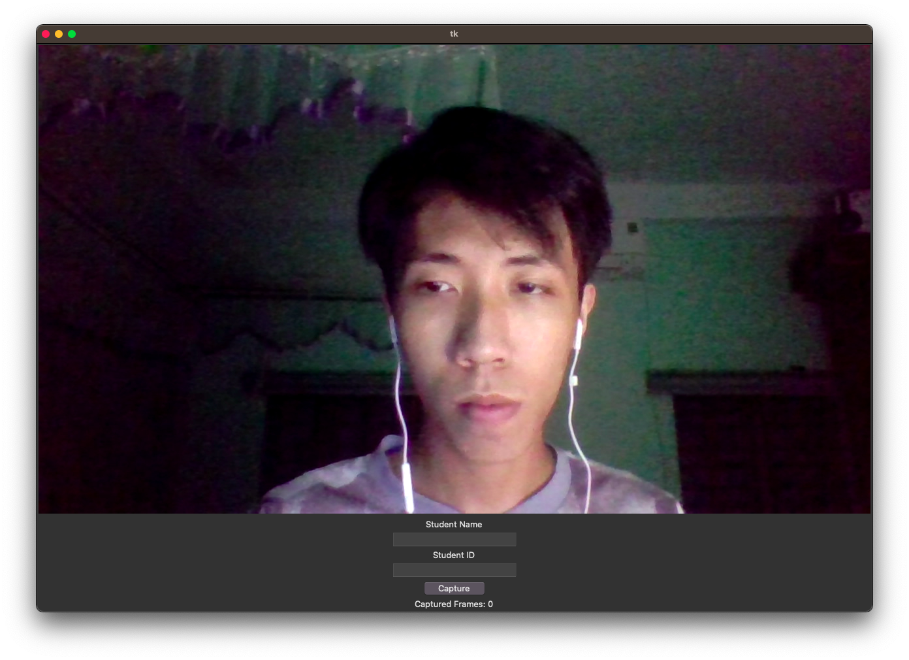
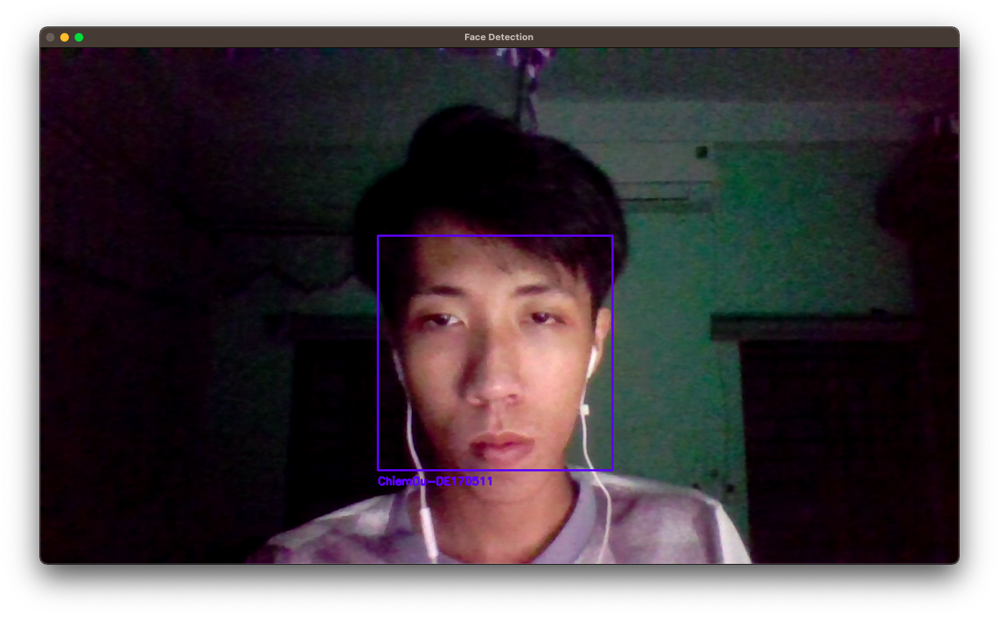

## **Face Recognition App for Attendance System**

### **Overview:**

The Face Recognition App for **Attendance System** is designed to facilitate an automated attendance system using computer vision. The system employs various functions, including streaming video from an Laptop camera, processing video frames for face detection and recognition, training a model for accurate recognition, and sending results to web browsers via <code>Socket.io</code>

### **Participant**

1. Nguyen Chiem Du
2. Nguyen Hoang Hai
3. Bui Khac Nhat Thanh

### **Functionalities:**

#### 1. Streaming from Laptop Camera (Function 1):

The application allows streaming video from an Laptop camera to a computer. It use the <code>cv2.VideoCapture</code> function to continously captrure the image from the camera and send it to <code>Tkinter</code>.

#### 2. Cropping Image Frames (Function 2):

The video stream is cropped into image frames based on the camera's capture rate and resolution. This step involves capturing the face from the video frames, providing an image that contains the student's face.

#### 3. Face Detection (Function 3):

From the captured image, the system detects the position of the student's face within the photo, providing a clear image of the student's facial features.

#### 4. Face Recognition (Function 4):

Utilizing the extracted face image, the system performs face recognition. It identifies the student by recognizing their student number, name, and records the date and time of their presence in class.

### **Code Structure and Implementation:**

The code is written in Python and employs various libraries and modules, including `tkinter`, `cv2` (OpenCV), `PIL` (Python Imaging Library), and custom modules for face detection, cropping, and training models.

The main structure of the code involves a `FaceRecognitionApp` class, which initializes the GUI and implements methods for various functions, including:


- `Collect Data`: Opens a window to capture multiple images of the student's face.
- `Crop All Faces`: Initiates the process to crop all faces in the dataset.
- `Train Model`: Uses HOG to extract feature from image and trains the model using a Support Vector Machine (SVM) for face recognition.
- `Face Recognition`: Performs face detection and face recognition from the laptop camera to classify the student.

All the UI is done using `Tkinter` library with the code below:

```python
class FaceRecognitionApp:
    def __init__(self, root):
        self.root = root
        self.root.eval('tk::PlaceWindow . center')
        self.root.geometry("400x400")

        self.collect_data = ttk.Button(root, text="Collect Data", command=self.open_collect_data)
        self.collect_data.pack()

        self.crop_all_faces_btn = ttk.Button(root, text="Crop All Faces", command=self.crop_all_faces)
        self.crop_all_faces_btn.pack()

        self.train_model_btn = ttk.Button(root, text="Train Model", command=self.train_model)
        self.train_model_btn.pack()

        self.face_recognition = ttk.Button(root, text="Face Recognition",command=realtime_face_detection)
        self.face_recognition.pack()
```

#### Collect Data

When user click on the **`Collect Data`** button, new windows will be created to show the camera view and text boxes for entering the username and student id.


After entering the neccessary data and press the **`Capture`** button, system will automatically capture 30 images to facial data. All images of a student will be hold on the same folder named `${student_name}-{student_id}`. Then, `face_cascade` libray will automatically detect the face cascade on each image and crop it to a new image one. This will finish the collect data for a student.
The code below will detect the face cascade and crop face to new image on each image inside a directory:

```python
def crop_faces_in_directory(input_dir = './data', output_dir = './cropped_image'):
    # Loop through all folders (each student's folder)
    for student_folder in list_student_dir(input_dir):
        student_path = os.path.join(input_dir, student_folder)
        output_student_path = os.path.join(output_dir, student_folder)
        make_dir(output_student_path)

        # Loop through all images in the student's folder
        for img_name in os.listdir(student_path):
            img_path = os.path.join(student_path, img_name)

            # Read the image
            img = cv2.imread(img_path)
            gray = cv2.cvtColor(img, cv2.COLOR_BGR2GRAY)

            # Detect faces in the image
            faces = face_cascade.detectMultiScale(gray, scaleFactor=1.1, minNeighbors=5,minSize = (250,250))

            # Crop and save each detected face into the respective student's output folder
            for i, (x, y, w, h) in enumerate(faces):
                face = img[y:y+h, x:x+w]
                output_file_path = os.path.join(output_student_path, f"face_{img_name}")
                cv2.imwrite(output_file_path, face)
```

This will finish the data collection step for a student, keep repeating for others

#### Crop All Faces

This method is usued in case the you already have data for all the students and want to crop all the faces again. The excecution code is the same as above:

#### Training models

Based on the croped faces feature that was previously created. We can start traning the model to predict the face. Our idea is using `HoG` for extracting feature from face image and the using `SVM` for traing model. Moreover, we need to save the results of the training models for the next time face recognition.
`HoG for feature extraction`

```python
def get_hog_feature(image, gray_convert = False):
    image = cv2.resize(image, (64, 128))  # Resize image if needed
    if gray_convert:
        image = cv2.cvtColor(image, cv2.COLOR_BGR2GRAY)
    # Extract features using HOG
    hog = cv2.HOGDescriptor()
    hog_features = hog.compute(image)
    return hog_features.flatten()
```

`SVM for training model`

```python
def svm_train_model(path = './cropped_image',save_model = True):
    # Load and preprocess images
    data = []
    labels = []

    # Iterate over your data folder
    for student_folder in os.listdir(path):
        for image_name in os.listdir(os.path.join(path, student_folder)):
            image_path = os.path.join(path, student_folder, image_name)
            image = cv2.imread(image_path)
            hog_features = get_hog_feature(image,gray_convert=True)

            data.append(hog_features)
            labels.append(student_folder)

    # Split data for training and testing
    X_train, X_test, y_train, y_test = train_test_split(data, labels, test_size=0.2, random_state=42)

    # Train SVM
    svm = SVC(kernel='poly')
    svm.fit(X_train, y_train)

    # Predict
    predictions = svm.predict(X_test)
    accuracy = accuracy_score(y_test, predictions)
    print("Accuracy:", accuracy)
    # Assuming 'svm' is your trained SVM model
    joblib.dump(svm, './models/svm_model.sav')
    return svm,accuracy
```

After finishing the training. We need to show the results of to the UI including the accuracy:


#### Face Recognition

This function use the trained SVM model to perform face recognition.



We can see the positions of all the faces will be bound in the blue box, bellow the box will be filled with the name of predicted student. So as long as the model predicted these students, they will be presented. However, the model would be confused or undetected at times. This can cause the false positive and false negative problems with attendance. So we create a rule that only if the model predicted that students 10 continuous times, we would considered that student is presented and send the data to web server:

```python
def realtime_face_detection():
    # init variables
    global time_series_data,last_student,times,is_subitted
    time_series_data = []
    last_student = None
    times = 0
    is_subitted =  {
    }
    # Open the default camera (0)
    cap = cv2.VideoCapture(0)

    # Load the saved SVM model
    loaded_svm = load_svm_model()

    while True:
        # Capture frame-by-frame
        ret, frame = cap.read()

        # Convert the frame to grayscale for face detection
        gray = cv2.cvtColor(frame, cv2.COLOR_BGR2GRAY)

        # Detect faces in the frame
        faces = face_cascade.detectMultiScale(gray, scaleFactor=1.1, minNeighbors=5,minSize = (250,250))

        # Draw rectangles around the faces
        for (x, y, w, h) in faces:
            cv2.rectangle(frame, (x, y), (x + w, y + h), (255, 0, 0), 2)


        # load saved svm model and predice the face
        gray_image = gray[y:y+h, x:x+w]

        hog_features = get_hog_feature(gray_image)

        # Perform prediction using the loaded SVM model
        predicted_student = loaded_svm.predict([hog_features])
        confidence = loaded_svm.decision_function([hog_features])[0]
        # get max value of confidence list
        max_confidence = max(confidence)

        print("Predicted student:", predicted_student[0])
        validate_face_detection(predicted_student[0])
        # Draw the text under the face
        cv2.putText(frame,  f'{predicted_student[0]}', (x, y+h+20), cv2.FONT_HERSHEY_SIMPLEX, 0.5, (255, 0, 0), 2)
        # Display the resulting frame
        cv2.imshow('Face Detection', frame)

        # Exit the loop if 'q' is pressed
        if cv2.waitKey(1) & 0xFF == ord('q'):
            break

```

The code below demonstrates how to send the data to the server:

```python
def send_attendance_data(predict_result):
    try:
        [student_name,student_id] = str(predict_result).split('-')
        # get current time to millisecond

        current_time = datetime.now().timestamp()
        data_to_send = {
            'name': student_name,
            'id': student_id,
            'time': current_time
        }
        print(data_to_send)
        response = requests.post(url, json=data_to_send)
        if response.status_code == 200:  # Successful response code (e.g., 200 OK)
            print("Data sent successfully!")
            print("Server Response:", response.text)
        else:
            print("Failed to send data. Status code:", response.status_code)
    except:
        print("Server error")
```

After receiving the data, server using socket.io for realtime communication with Wep App to update the status of sutdents:


The creaed the basic web app by `Flutter` to update the status of students.
The web app is deployed in the following:
[https://face-attendance-gnl9.onrender.com](https://face-attendance-gnl9.onrender.com)

###

### Conclusion:

The Face Recognition App for Attendance System is a fundamental implementation of computer vision for automating attendance processes. While it serves the basic requirements, further enhancements and refinements can significantly improve its accuracy, reliability, and usability.

This report provides an overview of the application's functionalities, code structure, and potential areas for improvement, laying the groundwork for its further development and refinement.
For more details, please visit our repository:

[https://github.com/nguyenchiemdu/face-recognition](https://github.com/nguyenchiemdu/face-recognition) <br/>
[https://github.com/nguyenchiemdu/face-attendance-api](https://github.com/nguyenchiemdu/face-attendance-api)
